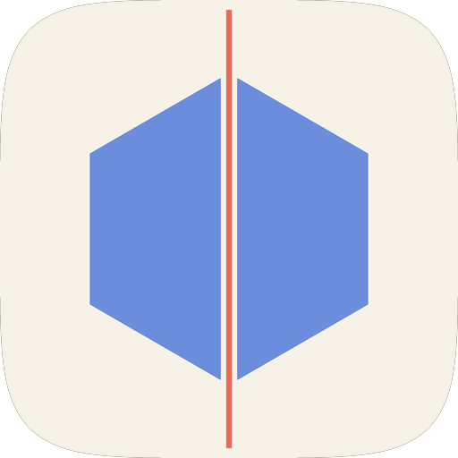
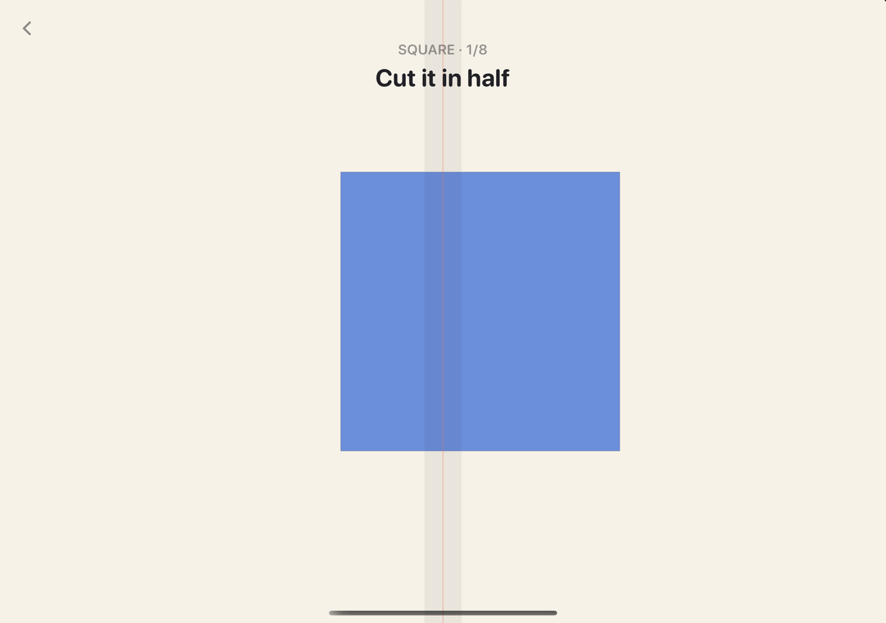
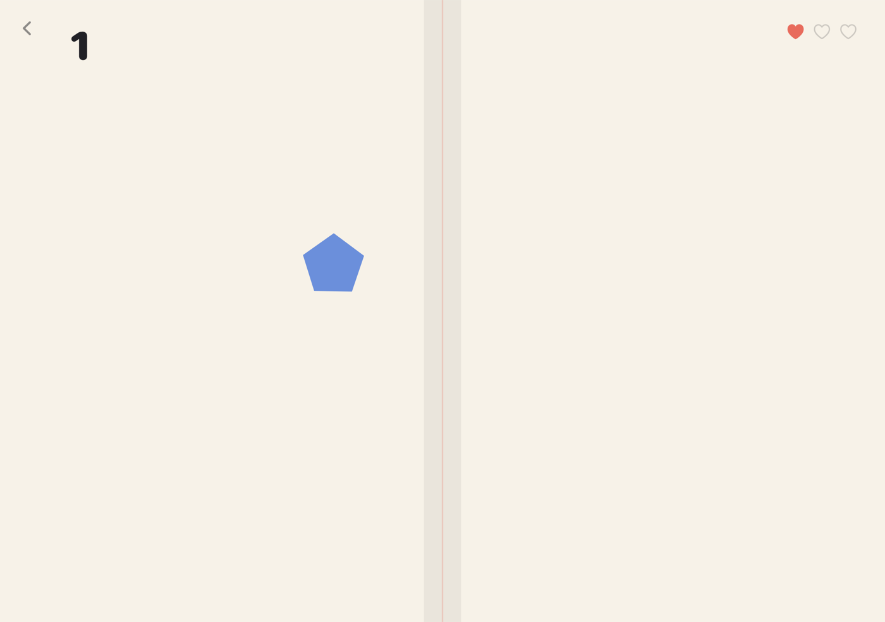

<p align="center">
  
</p>

<h1 align="center">DuoCut</h1>

<p align="center">
  Cut shapes in half by folding the <b>iPhone Duo</b>. The blade is the hinge.
</p>

<p align="center">
  
  
  
  
  <a href="LICENSE"></a>
</p>

<p align="center">
  
  
</p>

## How to Play

Other slicing games let you draw the cut. Here the cut can't move — it lives on the hinge — so
you move the shape instead.

- **Drag** a shape with one finger, **rotate** it with two.
- Judge it by eye. There's no live readout — the split only shows up after the cut.
- **Snap the hinge** — fold it about 12° — and the blade goes through the fold.

Three ways to play:

- **Daily** — one shape a day, the same for everyone, one cut. Keeps a streak and makes a share card.
- **Puzzle** — four packs of authored levels: even halves, exact fractions, sorting colored tokens, and two-cut levels.
- **Arcade** — shapes fly across the fold. Snap as they cross it; a snap cuts everything touching the blade at once.

No hinge? Swipe across the cut line instead. The whole game works on a phone that doesn't fold.

## How It Works

**The fold is the blade.** [`FoldLine`](DuoCut/Fold/FoldLine.swift) asks the geometry proxy where
the system reserves the division region, and that rectangle's center line is the cut:

```swift
let region = proxy.reservedRegions(kind: .division, options: [.includeInactive]).first
```

The `.includeInactive` matters: the division region is only *active* while the device is partially
folded, and the player needs to see the blade while the device is flat, when they're still aiming.
Regions can also arrive after the first layout pass, so it's read inside the `GeometryReader` body
and never cached.

**The snap is the trigger.** [`CutDetector`](DuoCut/Fold/CutDetector.swift) watches `onHingeChange`
and fires when the hinge closes 12° from its highest point, then re-arms once the device opens back
up by 6°. It's DuoBird's flap detector in the other direction, and it doubles as arcade timing.

**Cutting is real geometry, not a sprite trick.**
[`PolygonCut`](DuoCut/Geometry/PolygonCut.swift) splits a polygon with an infinite line: signed
distances per vertex, intersection points spliced into the ring, and the leftover chains stitched
back together along the cut. Concave shapes fall into as many pieces as they should — a horseshoe
cut across both arms gives one spine and two tips — and the areas always add back up to the
original. That part is under test in [`DuoCutTests`](DuoCutTests).

**Everything is drawn in a `Canvas`,** stepped by a `TimelineView(.animation)`: the shapes, the
blade, and the halves tumbling away after a cut. No SpriteKit, no physics engine.

## Requirements

- Xcode 27.1+
- iOS 27.1+ SDK
- iPhone Duo simulator or device for the hinge. Everywhere else, swipe to cut.

## Building

```bash
xcodebuild -project DuoCut.xcodeproj -scheme DuoCut \
  -destination 'platform=iOS Simulator,name=iPhone Duo' build
```

To open one screen straight away:

```bash
xcrun simctl launch booted com.artemnovichkov.DuoCut -mode arcade
xcrun simctl launch booted com.artemnovichkov.DuoCut -mode puzzle -pack fruit
```

In the simulator, move the hinge from the command line with [hinge](https://github.com/artemnovichkov/hinge).

## Project Structure

```
DuoCut
├── App          # Entry point, menu, palette
├── Geometry     # Polygons, lines, and the cut itself. No UI, under test
├── Fold         # The fold line from reserved regions, the snap detector
├── Play         # The board both modes share: shapes, tokens, pieces, blade
├── Puzzle       # Levels, packs, scoring, progress
├── Arcade       # Flying shapes, combos, lives
├── Meta         # Achievements, fold counter, daily challenge, share card
└── Resources    # Asset catalog
```

The Xcode project uses Xcode's JSON project format ([`project.xcproj`](DuoCut.xcodeproj/project.xcproj)).
Each source file is listed there with its target membership.

## Good to Know

- The division region is only active while the device is partially folded. Flat, it still exists —
  ask for `.includeInactive` or the blade disappears.
- The region's frame is a rectangle, not a line. Its longer side tells you whether the fold runs
  vertically or horizontally.
- The outer display reports no regions at all, so the game falls back to the middle of the view.

## Inspiration

- [Cutle](https://cutle.pages.dev/) and [Split Even](https://apps.apple.com/pl/app/split-even-cut-solve/id6762077207), daily "cut it in half" puzzles.
- [Kami](https://www.androidauthority.com/kami-foldable-phone-game-3632416/), an origami game for Android foldables where you line the paper up with the hinge and fold.

For more iPhone Duo APIs, see [iPhone Duo by Examples](https://github.com/artemnovichkov/iPhone-Duo-by-Examples).

## Author

Artem Novichkov, https://artemnovichkov.com/

## License

The project is available under the MIT license. See the [LICENSE](./LICENSE) file for more info.
